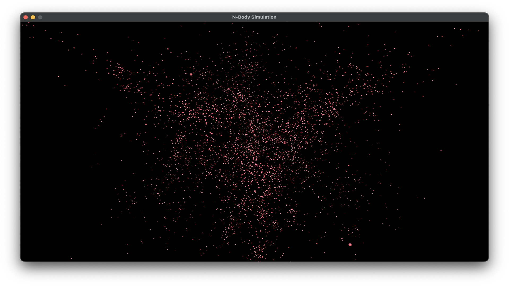
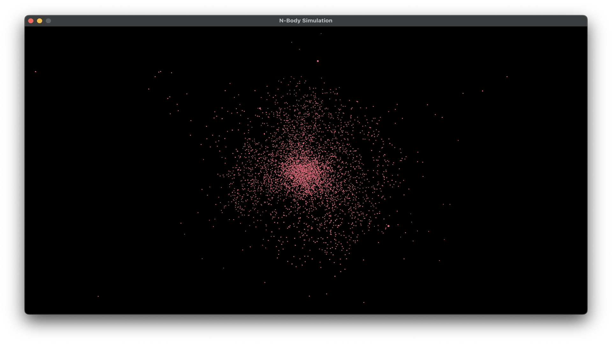

# NBody Viewer

This is a simple viewer for the NBody simulation. 
It is written in C++ and uses Raylib (OpenGL as backend) for rendering.

## Build

Everything can be built with CMake. All dependencies are included via CMake's FetchContent. 
The only requirement is a C++17 compiler and OpenGL 3.3.

### Linux
Then you can build the project with the following commands:

    mkdir build
    cd build
    cmake ..
    make

### MacOS
Then you can build the project with the following commands:

    mkdir build
    cd build
    cmake ..
    make

### Windows 
Not officially supported, and tested

## Run
To run the program, you can use the following command:

    ./nbody_viewer <path_to_data_file>

where `<path_to_data_file>` is the path to the data file generated by an NBody simulation.
The default path is `./output.txt`.

## Data file format

The data file is a text file with the following format:

    <position_1_x> <position_1_y> <position_1_z> 
    <position_2_x> <position_2_y> <position_2_z> 
    ...
    <position_n_x> <position_n_y> <position_n_z> 
    

    <position_1_x> <position_1_y> <position_1_z> 
    <position_2_x> <position_2_y> <position_2_z> 
    ...
    <position_n_x> <position_n_y> <position_n_z> 

    ...
    
where `<position_i_xyz>` are the coordinates of the i-th particle at the current time step. 
The different time steps are separated by two empty lines.

## Controls

The following controls are available:

- `W`/`S`/`A`/`D`/`left`/`right`/`up`/`down`: Move the camera
- `ESC`: Exit the program (not possible in Web mode)
- `P`: Debug mode (shows light source and FPS)
- `Q`: Toggle pause mode
- some other controls exist, but are only for testing purposes

To upload a file just drag and drop it into the window/browser.

## Web
A web hosted version is available at [https://gagalp.github.io/nbody_viewer/](https://gagalp.github.io/nbody_viewer/).

## Screenshots

